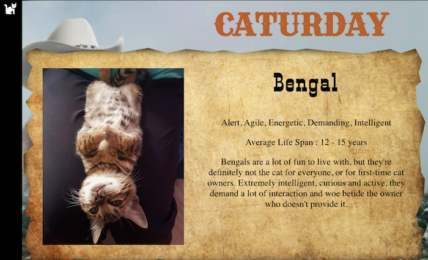
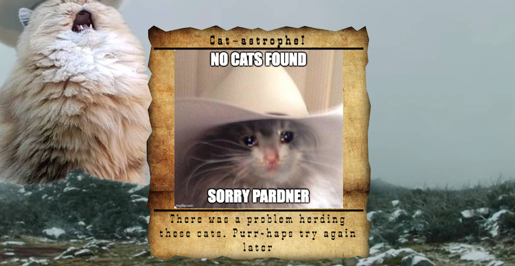

# Caturday


## About The Project
Caturday is a place for both cat-enthusiasts and new-to-cats-users to learn more about cat breeds and potentially find one that would match their lifestyle— all in a Western theme.

This was an assignment from Turing School of Software and Design's Front End Engineering program, known as the Stretch Tech project. Stretch Tech is a group project focused on learning and implementing a new technology with peers rather than being taught by instructors with a structured curriculum. We chose to learn and implement Typescript. 

    It's a-meow-zing what you can learn in just a week! 

With this application users are able to view a cat of the day, a list of cat breeds fetched from a RESTful API. To learn more about a breed, the user can click on the wanted poster preview and get additional information. Users can also filter by the affection level of cats


## Technologies
* Typescript
* React | React Router
* Cypress
* Javascript
* HTML
* CSS

## Set Up Instructions
#### Deployed Site
1. Visit [Caturday](https://caturday-2201-fe.herokuapp.com/) via your browser

#### Running it Locally
1. Clone this repo to your local machine
2. `cd ` into `Caturday`
3. Then, run `npm install `from your command line. Do not run `npm audit fix --force`
4. After you run npm install inside of your copy of this repo, run:
`npm start`
This command runs the app in the development mode locally so that you can view and use the application in your browser.
```
You can now view Caturday in the browser.
  Local:  http://localhost:3000
```

5. When you are done exploring _**Caturday**_ make sure that you type `Control + C` in your terminal to stop the server before closing your Terminal.
---
## Using the Application
Upon load, a user will see a featured **Cat of the Day** below the Caturday title. Upon hover, the cat in the sky welcomes the user with a friendly "Meowdy Folks!" To learn about a cat, the user can slimply click on the Wanted poster. They can return home by clicking Cat of the Day or All Cats from the sidebar, using the brower back button, or removing the `/cats/(cat's id)` from the URL.


#### Filtering By Affection
If intending to adopt a breed, the user can select an affection level to see what cat matches their style. If no cats are a match the search, they will be shown an error message. 


#### Breed Information
To learn more about a breed of cat, the user can see additional information when they click on a Wanted Poster. 


#### Error Handling
If Cat-astrophe hits and our there is a problem fetching and herding the cats for our users, we have made sure that the user knows something is wrong. 



----
## Contributors
- [Emma Brooke-Davison](https://github.com/emmacbd)
- [Shane Warning](https://github.com/shanekwarning)
- [Angele Williams](https://github.com/angelewilliams)
- [Oakley Windiate](https://github.com/oakleywindiate)

## Acknowledgments

* [Turing Scool of Software & Design](https://turing.edu/)
* Turing Instructors: Kayla Gordon and Robbie Jaeger
* [The Cat API](https://docs.thecatapi.com/)


#### Planning Resources

* [MVP Planning](https://docs.google.com/document/d/1kWYpUBlvos-K7xBsRH4wt7K9NMBGLe2GjCjtbkYCnpo/edit?usp=sharing)
* [Project Spec](https://frontend.turing.edu/projects/module-3/stretch.html)
